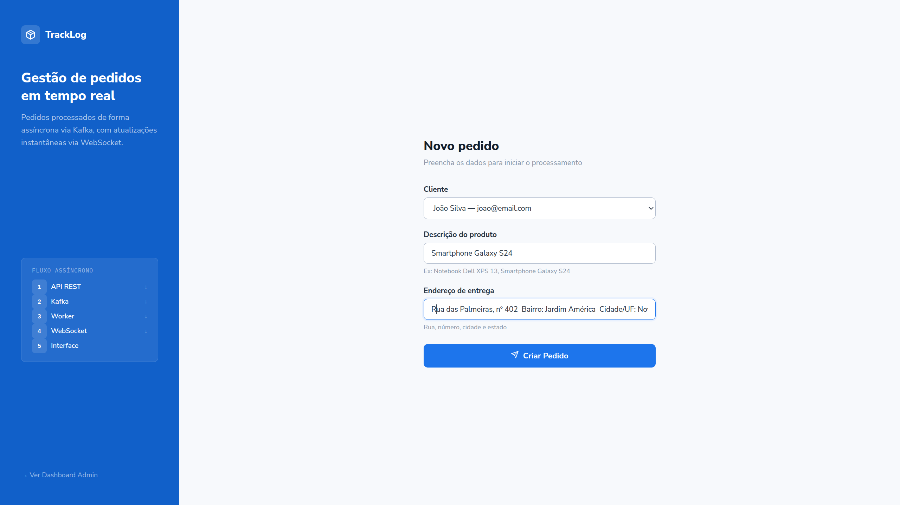
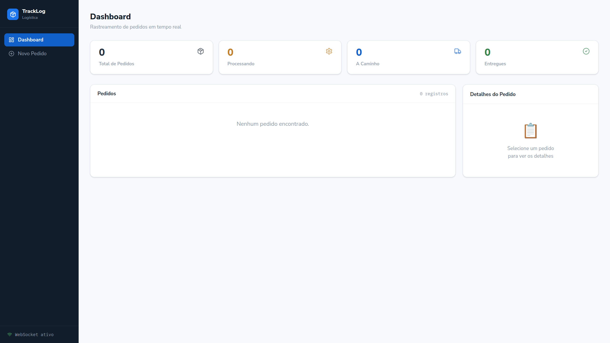
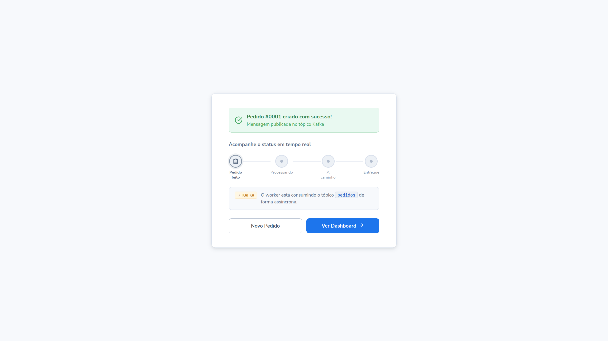
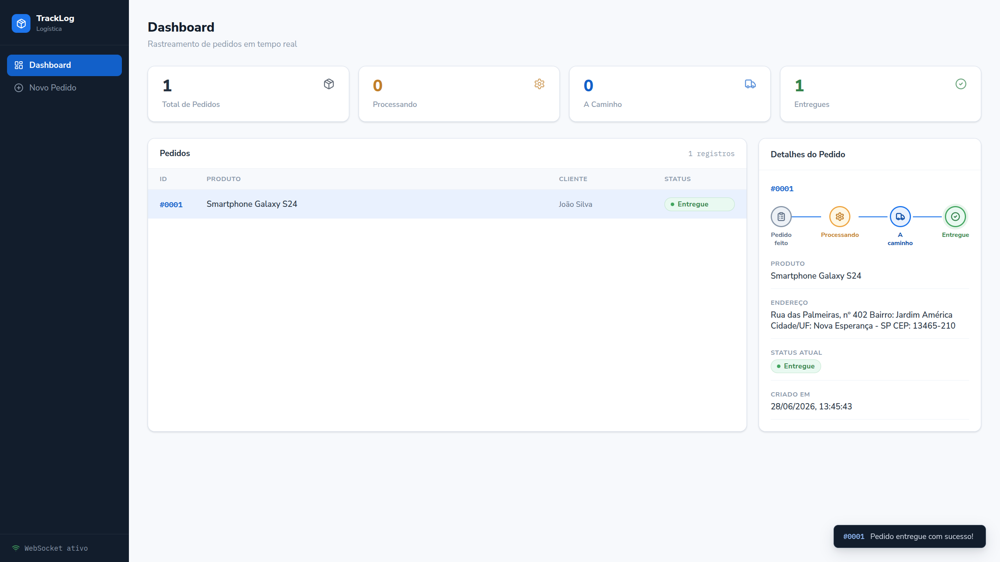

> 🇺🇸 [English version](README.md)

# TrackLog — Sistema de Rastreamento de Entregas

**Projeto Integrador — ADS 5º Período | N2**

Sistema distribuído de logística com processamento assíncrono via Apache Kafka, arquitetura hexagonal, design patterns e atualização em tempo real via WebSocket.

---

## Screenshots

<p align="center">
  
  
  
  
</p>

---

## Arquitetura

```
┌─────────────────┐     POST /pedidos      ┌──────────────────┐
│                 │ ──────────────────────> │                  │
│  Frontend React │                        │  API REST (3001) │
│  Socket.io      │ <── WebSocket (3002) ── │  + Kafka Producer│
│                 │    status_atualizado    │                  │
└─────────────────┘                        └────────┬─────────┘
                                                    │
                                           Publica em tópico
                                           "pedidos" no Kafka
                                                    │
                                           ┌────────▼─────────┐
                                           │                  │
                                           │  Worker (3002)   │
                                           │  Kafka Consumer  │
                                           │  + WebSocket     │
                                           │  Gateway         │
                                           └────────┬─────────┘
                                                    │
                                          Executa Strategy Pattern:
                                          PENDENTE → PROCESSANDO
                                          PROCESSANDO → ENVIADO
                                          ENVIADO → ENTREGUE
                                                    │
                                           ┌────────▼─────────┐
                                           │   PostgreSQL     │
                                           │   (porta 5432)   │
                                           └──────────────────┘
```

---

## Design Patterns Aplicados

| Pattern | Onde | Por quê |
|---------|------|---------|
| **Strategy** | `StatusStrategy.js` | Cada status tem seu algoritmo de processamento; fácil de estender |
| **Factory** | `StatusStrategyFactory`, `KafkaProducerFactory` | Centraliza criação de objetos complexos |
| **Repository** | `PedidoRepository` | Desacopla acesso ao banco da lógica de negócio |
| **Dependency Injection** | `server.js`, `worker.js` | Permite trocar implementações sem alterar casos de uso |

---

## Estrutura do Projeto

```
projeto-logistica/
├── docker-compose.yml          # Orquestração completa
├── backend/
│   ├── src/
│   │   ├── domain/
│   │   │   └── Pedido.js       # Entidade pura de domínio
│   │   ├── application/
│   │   │   ├── StatusStrategy.js        # Strategy + Factory Pattern
│   │   │   └── usecases/
│   │   │       ├── CriarPedidoUseCase.js
│   │   │       └── ListarPedidosUseCase.js
│   │   ├── infrastructure/
│   │   │   ├── kafka/
│   │   │   │   ├── KafkaProducer.js     # Publica mensagens
│   │   │   │   └── KafkaConsumer.js     # Consome e processa
│   │   │   ├── websocket/
│   │   │   │   └── WebSocketGateway.js  # Notifica frontend
│   │   │   └── database/
│   │   │       └── PedidoRepository.js  # Repository Pattern
│   │   ├── interfaces/
│   │   │   └── controllers/
│   │   │       └── PedidoController.js  # Controllers REST
│   │   ├── server.js           # Entry point da API
│   │   └── worker.js           # Entry point do Consumer
│   └── tests/
│       ├── Pedido.test.js
│       ├── StatusStrategy.test.js
│       └── CriarPedidoUseCase.test.js
└── frontend/
    └── src/
        ├── pages/
        │   ├── NovoPedido.js   # Formulário de criação
        │   └── Dashboard.js    # Painel admin
        ├── components/
        │   └── StatusBadge.js  # Badge + Timeline animada
        ├── hooks/
        │   └── useWebSocket.js # Hook de conexão WebSocket
        └── services/
            └── api.js          # Camada de comunicação HTTP
```

---

## Como Executar

### Pré-requisitos
- Docker e Docker Compose instalados

### Subir tudo com um comando

```bash
docker compose up --build
```

Aguarde ~30 segundos para o Kafka inicializar. Acesse:

- **Frontend:** http://localhost:3000
- **API:** http://localhost:3001
- **WebSocket:** http://localhost:3002
- **Health check:** http://localhost:3001/health

### Rodar testes

```bash
cd backend
npm install
npm test
# ou com cobertura:
npm test -- --coverage
```

---

## Fluxo Completo

1. Acesse http://localhost:3000
2. Selecione um cliente e preencha o pedido
3. Clique em **Criar Pedido**
4. Observe a timeline animada atualizando automaticamente:
   - `PENDENTE` → `PROCESSANDO` (1s)
   - `PROCESSANDO` → `ENVIADO` (3s)
   - `ENVIADO` → `ENTREGUE` (5s)
5. **A atualização acontece sem refresh** — via Kafka + WebSocket
6. Abra http://localhost:3000/dashboard para ver todos os pedidos

---

## Tecnologias

| Tecnologia | Uso |
|------------|-----|
| Apache Kafka 7.5 | Broker de mensagens (tópico `pedidos`) |
| Node.js + Express | API REST e Worker |
| Socket.io | WebSocket para atualização em tempo real |
| PostgreSQL 16 | Persistência com histórico de status |
| React 18 | Interface do usuário |
| Docker Compose | Orquestração de todos os serviços |
| Jest + Supertest | Testes unitários e de integração |